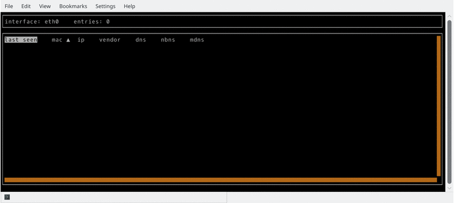

# landiscover



Landiscover is a zero-configuration command-line tool that allows to discover every device connected to a local network, together with their hostname, in a very short period of time. It is intended for fast service discovery (i.e. finding a printer or a IoT device), without recurring to other tools that are often slow, difficult to remember or offer partial results. Although there are many applications already available for the scope, this one combines multiple techniques present individually in other softwares, in order to obtain the most complete result available without recurring to port scanning-based tool (i.e. Nmap). In particular:
* Arping technique is used for node discovery;
* DNS protocol is used for hostname discovery;
* Multicast DNS (MDNS) protocol is used for node and hostname discovery;
* NetBIOS protocol is used for node and hostname discovery.

The software is entirely written in Go, and the only external dependency is libpcap.


## Installation

* Prebuilt binaries are available in the [release page](https://github.com/gswly/landiscover/releases).
* Otherwise it is possibile to compile from source by following the instructions below.


## Usage

Open a terminal in the same directory as the executable and run:
```bash
./landiscover
```

It is also possible to set additional options by using the full syntax:
```bash
./landiscover [--passive] [interface]
```

## Compilation (dockerized)

1) Install dependencies:
* Docker

2) Compile in a container:
```bash
./build.sh [arch]
```

3) Replace [arch] with one of the supported architectures:
* amd64
* armv7

## Compilation (manual)

1) Install dependencies:
* libpcap headers
* go >= 1.11

2) Download required modules:
```bash
go mod init
```

3) Compile:
```
go build
```
